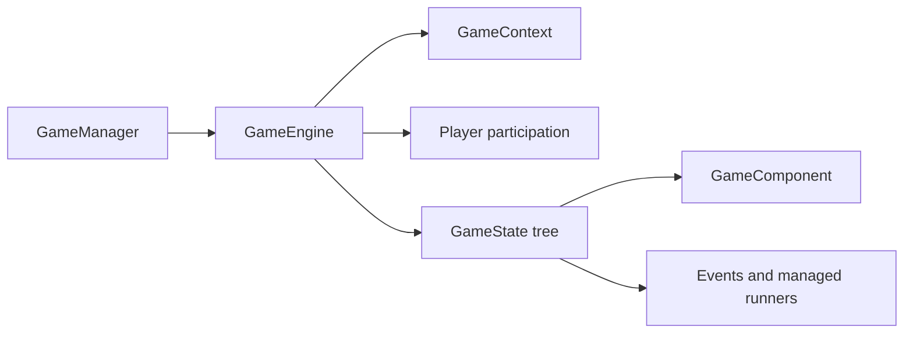

<p align="center">
  
</p>

[](https://github.com/XiaoYangx666/SAPI-Game/actions/workflows/verify.yml) [](./LICENSE) [](https://qm.qq.com/q/YCQ7ohJpIc)

**A framework for building games and gameplay Addons on Minecraft Bedrock.**

**English** · [简体中文](./README.zh-CN.md)

BEGame is a TypeScript game framework built on Minecraft Bedrock Script API. It brings game instances, state-driven workflows, reusable components and player participation into a shared runtime structure.

## Why BEGame?

- **Give every resource an owner.** State-scoped event subscriptions, components and managed runners are released when their state ends. This makes cleanup part of the game's structure.
- **Reuse behavior across games.** Compose timers, region protection, player interaction policies, displays and room cleanup as components, then add game-specific behavior through the same model.
- **Run multiple instances in one world.** Each instance has its own context, state tree and player manager. Participation policies coordinate membership across games within a Script runtime.
- **Make lifecycle bugs reproducible.** Use the headless test host to execute the actual framework and exercise transitions, reconnects, timeouts, rollback and resource cleanup.
- **Inspect what happened.** Optional Trace records lifecycle and developer-defined business events. Observatory provides a local workbench for session inspection and export.
- **Keep integrations explicit.** Built-in server integration and platform-specific Trace bindings have separate entry points. Bundle checks guard the boundaries of optional features.

## Core ideas

**A game owns a session. A state owns a phase. A component owns a behavior.**



Model phases as states and reusable behavior as components. Keep game rules and match data separate from runtime resources and presentation, with explicit game-owned persistence and recovery.

## Get started

```sh
npm install @begame/core
```

The behavior pack supplies the Minecraft peer dependencies and bundles BEGame into its script entry. Follow the [getting started guide](./docs/getting-started.md), then read [architecture and ownership](./docs/architecture.md) and the [game authoring tutorial](./tutorial/使用教程.md).

Use the [documentation index](./docs/README.md) to find component, room lifecycle, testing and Trace guides. Detailed gameplay tutorials are currently in Chinese.

## Packages

| Package | Purpose |
| --- | --- |
| [@begame/core](./packages/core/README.md) | Game lifecycle, states, components and participation |
| [@begame/test](./packages/test/README.md) | Headless lifecycle testing with Vitest |
| [@begame/trace-spec](./packages/trace-spec/README.md) | Shared Trace vocabulary and types |
| [@begame/trace](./packages/trace/README.md) | Trace codec, sessions, history and platform bindings |
| [@begame/observatory](./packages/observatory/README.md) | Local Trace inspection workbench and CLI |

Install the packages you need and keep installed BEGame packages on the same release version.

## Community

See [PartyGames](https://gitee.com/ykxyx666_admin/partygames) for a game project built with the framework.

Report bugs or propose improvements through this repository's Issues and Pull Requests. Chinese community: [QQ group 1004513100](https://qm.qq.com/q/YCQ7ohJpIc).

[MIT licensed](./LICENSE). Release maintainers: see the [release guide](./docs/releasing.md).
