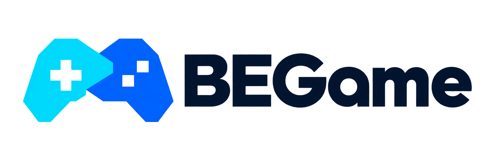
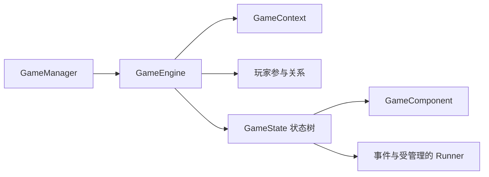

<p align="center">
  
</p>

[](https://github.com/XiaoYangx666/SAPI-Game/actions/workflows/verify.yml) [](./LICENSE) [](https://qm.qq.com/q/YCQ7ohJpIc)

**面向 Minecraft 基岩版游戏与游戏类 Addon 的开发框架。**

[English](./README.md) · **简体中文**

BEGame 是基于 Minecraft Bedrock Script API 的 TypeScript 游戏框架，将游戏实例、状态驱动的流程、可复用组件和玩家参与关系组织在统一的运行时结构中。

## 为什么使用 BEGame？

- **资源有明确归属。** State 管理的事件订阅、组件和 Runner 随状态结束一起释放，让清理成为游戏结构的一部分。
- **行为可以复用。** 用组件组合计时器、区域保护、玩家交互规则、显示和房间回收；游戏自己的行为也可以用同一模型扩展。
- **支持同一世界中的多实例。** 每个实例持有自己的上下文、状态树和玩家管理器，参与策略协调同一 Script runtime 内不同游戏的成员资格。
- **生命周期问题可以复现。** 无头测试宿主执行真实框架，覆盖状态切换、重连、超时、异常回滚与资源清理。
- **游戏过程可以追踪。** 可选 Trace 记录生命周期与开发者定义的业务事件，Observatory 提供本地会话分析和导出工作台。
- **集成方式明确。** 内置服务器集成、平台相关的 Trace 绑定使用独立入口，构建检查守住可选功能的打包边界。

## 核心理念

**Game 管理一次游戏会话，State 管理一个阶段，Component 管理一种行为。**



把阶段建模为状态，把可复用行为交给组件。游戏规则与对局数据独立于运行时资源和表现层，存档与恢复由游戏明确设计。

## 开始使用

```sh
npm install @begame/core
```

行为包提供 Minecraft peer 依赖，并把 BEGame 打包进脚本入口。先阅读[接入指南](./docs/getting-started.md)，再了解[架构与资源归属](./docs/architecture.md)，然后按照[使用教程](./tutorial/使用教程.md)创建游戏。

[文档目录](./docs/README.md)提供组件、房间生命周期、测试和 Trace 等指南。详细游戏教程目前主要使用中文。

## 包一览

| 包                                                      | 职责                               |
| ------------------------------------------------------- | ---------------------------------- |
| [@begame/core](./packages/core/README.md)               | 游戏生命周期、状态、组件与参与关系 |
| [@begame/test](./packages/test/README.md)               | 基于 Vitest 的无头生命周期测试     |
| [@begame/trace-spec](./packages/trace-spec/README.md)   | Trace 共享词汇表与类型             |
| [@begame/trace](./packages/trace/README.md)             | Trace 编解码、会话、历史与平台绑定 |
| [@begame/observatory](./packages/observatory/README.md) | 本地 Trace 分析工作台与 CLI        |

按需安装，已安装的 BEGame 包保持同一发布版本。

## 交流与反馈

参考使用框架的 [PartyGames 项目](https://gitee.com/ykxyx666_admin/partygames)。

通过仓库 Issues 反馈问题、Pull Requests 提交改进。[QQ 交流群：1004513100](https://qm.qq.com/q/YCQ7ohJpIc)。

采用 [MIT 协议](./LICENSE)。发布维护流程见[发布指南](./docs/releasing.md)。
